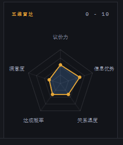
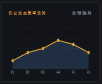
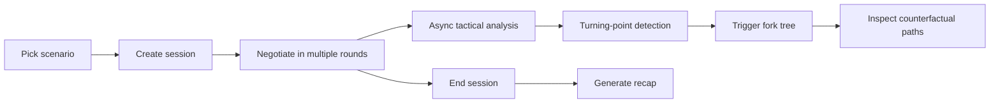

<p align="center">
  
</p>

<h1 align="center">NegotiationForge</h1>

<p align="center">
  🤝 An adversarial negotiation simulator for live analysis, structured recap, and fork-tree exploration
</p>

<p align="center">
  
  
  
  
  
  
</p>

<p align="center">
  <a href="./README.md">中文文档</a> |
  <a href="./README-EN.md">English</a> |
  <a href="./docs/QUICKSTART-EN.md">Quick Start</a> |
  <a href="./docs/CONFIGURATION-EN.md">Configuration</a> |
  <a href="./docs/ARCHITECTURE-EN.md">Architecture</a>
</p>

<p align="center">
  
</p>

## ✨ Overview

NegotiationForge is an AI system for negotiation training, tactical experimentation, and counterfactual decision rehearsal.

You can choose a negotiation scenario, run a multi-round exchange against an AI opponent with explicit goals, bottom lines, patience, emotional state, and strategy shifts, then review the session through live tactical analysis, turning-point detection, structured recap generation, and fork-tree simulation from critical turns.

This project is closer to a negotiation workbench than a simple chat demo. It is useful for:

- 🎯 negotiation practice and messaging drills
- 🧠 AI agent behavior design experiments
- 🔍 counterfactual analysis of decision paths
- 🧪 human-AI adversarial interface prototyping
- 📚 teaching, research, and tactical discussion

---

## 🖼️ Preview

<table>
  <tr>
    <td colspan="2" align="center">
      
      <br />
      <sub>Home and scenario board: choose an opening path and inspect the mission setup</sub>
    </td>
  </tr>
  <tr>
    <td colspan="2" align="center">
      
      <br />
      <sub>Main workspace: live negotiation, tactical analysis, and fork-tree panel in one layout</sub>
    </td>
  </tr>
  <tr>
    <td align="center">
      
      <br />
      <sub>Analysis panel: five-dimension radar chart</sub>
    </td>
    <td align="center">
      
      <br />
      <sub>Analysis panel: agreement probability trend</sub>
    </td>
  </tr>
  <tr>
    <td align="center">
      
      <br />
      <sub>Recap view: outcome summary, turning points, and improvement suggestions</sub>
    </td>
    <td align="center">
      
      <br />
      <sub>Fork-tree view: alternative branches and layered downstream simulations</sub>
    </td>
  </tr>
</table>

---

## 🚀 Core Capabilities

### 1. AI Negotiation Opponent

- Not a one-shot chatbot, but a role-driven opponent with goals, budget, bottom line, and internal state
- Strategy can shift over time, for example pressure, delay, concession, reframing, or hard resistance
- Satisfaction, patience, rapport, and phase evolve across rounds

### 2. Live Tactical Analysis

- Each completed round can trigger asynchronous analysis in the background
- The system scores leverage, information advantage, relationship temperature, agreement probability, satisfaction, and more
- Critical turns are auto-marked and later reused by recap and fork-tree generation

### 3. Structured Recap

- Produces a structured post-session summary
- Highlights turning points, strong moves, weak moves, and next-step improvements
- Includes a deterministic fallback path when the upstream model service is temporarily unavailable

### 4. Fork Tree Simulation

- Reuses previously marked critical turns from the mainline negotiation
- Generates alternative user strategies for each key turn
- Simulates a two-layer continuation chain for every alternative path

### 5. Local-First Developer Workflow

- SQLite is the default persistence layer, so no external database is required for local runs
- Environment configuration is minimal and straightforward
- Frontend, backend, analysis, recap, and fork-tree logic are separated cleanly for future extension

---

## 🧱 Tech Stack

### Frontend

- Next.js 15
- React 19
- TypeScript
- Tailwind CSS

### Backend

- FastAPI
- Pydantic
- SQLAlchemy Async
- SQLite

### Model Providers

- DeepSeek
- OpenAI-compatible APIs
- Gemini

---

## ⚡ Quick Start

### 1. Requirements

Make sure you have:

- Python 3.11+
- Node.js 20+
- npm
- at least one usable LLM API key

`DeepSeek` is the easiest default option because the example configuration already targets it.

### 2. Clone the repository

```bash
git clone https://github.com/Powfu-zwx/NegotiationForge.git
cd NegotiationForge
```

### 3. Start the backend

```bash
cd backend
python -m venv .venv
```

Windows:

```powershell
.venv\Scripts\activate
```

macOS / Linux:

```bash
source .venv/bin/activate
```

Install dependencies and prepare environment variables:

```bash
pip install -r requirements.txt
cp .env.example .env
```

Run the API:

```bash
uvicorn app.main:app --reload
```

Default backend address:

```text
http://localhost:8000
```

### 4. Start the frontend

```bash
cd frontend
npm install
cp .env.local.example .env.local
npm run dev
```

Default frontend address:

```text
http://localhost:3000
```

### 5. First-run flow

1. Open the frontend and pick a scenario
2. Create a session and enter the live negotiation workspace
3. Exchange messages with the AI opponent
4. Finish the negotiation and inspect analysis plus recap
5. Trigger fork-tree generation and inspect alternative branches

For a fuller walkthrough, see [docs/QUICKSTART-EN.md](./docs/QUICKSTART-EN.md)

---

## ⚙️ Configuration

### Backend environment variables

| Variable | Description | Default |
| --- | --- | --- |
| `APP_ENV` | Runtime environment label | `development` |
| `APP_HOST` | API host | `0.0.0.0` |
| `APP_PORT` | API port | `8000` |
| `DEBUG` | Debug mode | `true` |
| `ALLOWED_ORIGINS` | CORS allowlist | `http://localhost:3000` |
| `LLM_PROVIDER` | Active provider key | `deepseek` |
| `DEEPSEEK_API_KEY` | DeepSeek API key | empty |
| `DEEPSEEK_BASE_URL` | DeepSeek base URL | `https://api.deepseek.com` |
| `DEEPSEEK_MODEL` | DeepSeek model name | `deepseek-chat` |
| `OPENAI_API_KEY` | OpenAI-compatible API key | empty |
| `OPENAI_BASE_URL` | OpenAI-compatible base URL | `https://api.openai.com/v1` |
| `OPENAI_MODEL` | OpenAI-compatible model name | `gpt-4o-mini` |
| `GEMINI_API_KEY` | Gemini API key | empty |
| `GEMINI_BASE_URL` | Gemini base URL | `https://generativelanguage.googleapis.com/v1beta` |
| `GEMINI_MODEL` | Gemini model name | `gemini-2.0-flash` |
| `DATABASE_URL` | Database connection string | `sqlite+aiosqlite:///./negotiationforge.db` |

### Frontend environment variables

| Variable | Description | Default |
| --- | --- | --- |
| `NEXT_PUBLIC_API_URL` | Base URL used by frontend requests | `http://localhost:8000/api/v1` |

### Example provider setups

#### DeepSeek

```env
LLM_PROVIDER=deepseek
DEEPSEEK_API_KEY=your-key
DEEPSEEK_BASE_URL=https://api.deepseek.com
DEEPSEEK_MODEL=deepseek-chat
```

#### OpenAI-compatible

```env
LLM_PROVIDER=openai
OPENAI_API_KEY=your-key
OPENAI_BASE_URL=https://api.openai.com/v1
OPENAI_MODEL=gpt-4o-mini
```

#### Gemini

```env
LLM_PROVIDER=gemini
GEMINI_API_KEY=your-key
GEMINI_BASE_URL=https://generativelanguage.googleapis.com/v1beta
GEMINI_MODEL=gemini-2.0-flash
```

More detailed configuration notes are in [docs/CONFIGURATION-EN.md](./docs/CONFIGURATION-EN.md)

---

## 🔌 API Overview

Main endpoints under `/api/v1`:

| Method | Path | Description |
| --- | --- | --- |
| `GET` | `/scenarios` | List available negotiation scenarios |
| `POST` | `/sessions` | Create a new negotiation session |
| `POST` | `/sessions/{session_id}/chat` | Send a user message and get the opponent reply |
| `POST` | `/sessions/{session_id}/complete` | End a negotiation manually with `agreement` or `breakdown` |
| `GET` | `/sessions/{session_id}/analysis` | Fetch stored round analysis |
| `POST` | `/sessions/{session_id}/summary` | Generate a recap |
| `GET` | `/sessions/{session_id}/summary` | Read the stored recap |
| `POST` | `/sessions/{session_id}/fork-tree` | Trigger asynchronous fork-tree generation |
| `GET` | `/sessions/{session_id}/fork-tree` | Fetch current fork-tree status or the completed tree |

After the backend is running, you can also use:

- Swagger UI: `http://localhost:8000/docs`
- ReDoc: `http://localhost:8000/redoc`

---

## 🧭 Core Flow



---

## 🗂️ Repository Layout

```text
NegotiationForge/
|- backend/
|  |- app/
|  |  |- api/routes/       # FastAPI routes
|  |  |- core/             # global configuration
|  |  |- db/               # database setup and sessions
|  |  |- llm/              # provider abstraction layer
|  |  |- models/           # Pydantic and ORM models
|  |  `- services/         # business services
|  |- scenarios/           # JSON scenario files
|  |- requirements.txt
|  `- .env.example
|- frontend/
|  |- app/                 # Next.js App Router
|  |- components/          # UI components
|  |- lib/                 # API wrappers
|  |- package.json
|  `- .env.local.example
|- docs/
|  |- images/
|  |- ARCHITECTURE-EN.md
|  |- CONFIGURATION-EN.md
|  `- QUICKSTART-EN.md
|- .github/
|- LICENSE
|- README.md
`- README-EN.md
```

---

## 📚 Documentation Index

| Document | Chinese | English |
| --- | --- | --- |
| Repository Home | [README.md](./README.md) | [README-EN.md](./README-EN.md) |
| Quick Start | [docs/QUICKSTART.md](./docs/QUICKSTART.md) | [docs/QUICKSTART-EN.md](./docs/QUICKSTART-EN.md) |
| Configuration | [docs/CONFIGURATION.md](./docs/CONFIGURATION.md) | [docs/CONFIGURATION-EN.md](./docs/CONFIGURATION-EN.md) |
| Architecture | [docs/ARCHITECTURE.md](./docs/ARCHITECTURE.md) | [docs/ARCHITECTURE-EN.md](./docs/ARCHITECTURE-EN.md) |
| Contributing | [CONTRIBUTING.md](./CONTRIBUTING.md) | [CONTRIBUTING-EN.md](./CONTRIBUTING-EN.md) |

---

## 🛠️ FAQ

### 1. The frontend opens, but API requests fail

Check these first:

- make sure `backend/.env` exists
- confirm `NEXT_PUBLIC_API_URL` points to the correct backend
- verify the backend is actually running on `http://localhost:8000`

### 2. Recap generation reports model/provider issues

This project already retries certain upstream failures and includes a fallback recap path, but you should still verify:

- your network is stable
- the API key is valid
- the model name matches the provider base URL

### 3. The fork tree does not appear immediately

Fork-tree generation is asynchronous. The frontend polls status in the background, so the result can show up a few seconds later.

### 4. Can I end the negotiation manually

Yes. The live workspace already supports manual termination via `/sessions/{session_id}/complete`.

---

## 🤝 Contributing and Open Source

Issues and pull requests are welcome.

- Chinese guide: [CONTRIBUTING.md](./CONTRIBUTING.md)
- English guide: [CONTRIBUTING-EN.md](./CONTRIBUTING-EN.md)
- Security policy: [SECURITY.md](./SECURITY.md)
- Community rules: [CODE_OF_CONDUCT.md](./CODE_OF_CONDUCT.md)

---

## ⚠️ Disclaimer

This project is intended for research, learning, teaching demos, interface experiments, and negotiation practice.

Do not use the output of this project as the sole basis for high-stakes legal, employment, investment, medical, or business decisions. LLM output may be incorrect, biased, or unstable, and should always be reviewed critically.

---

## 📄 License

This project is released under the [MIT License](./LICENSE).
