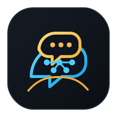
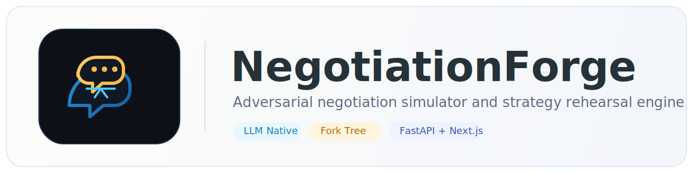
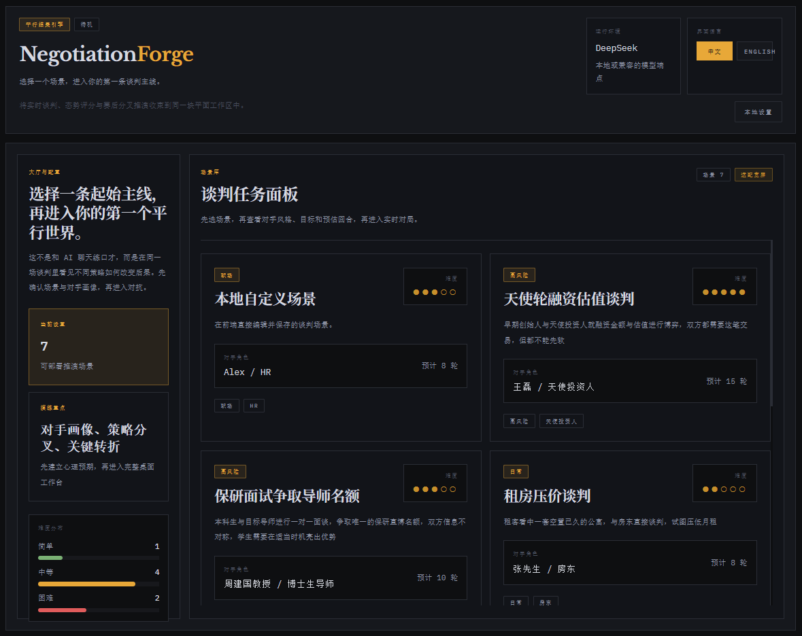
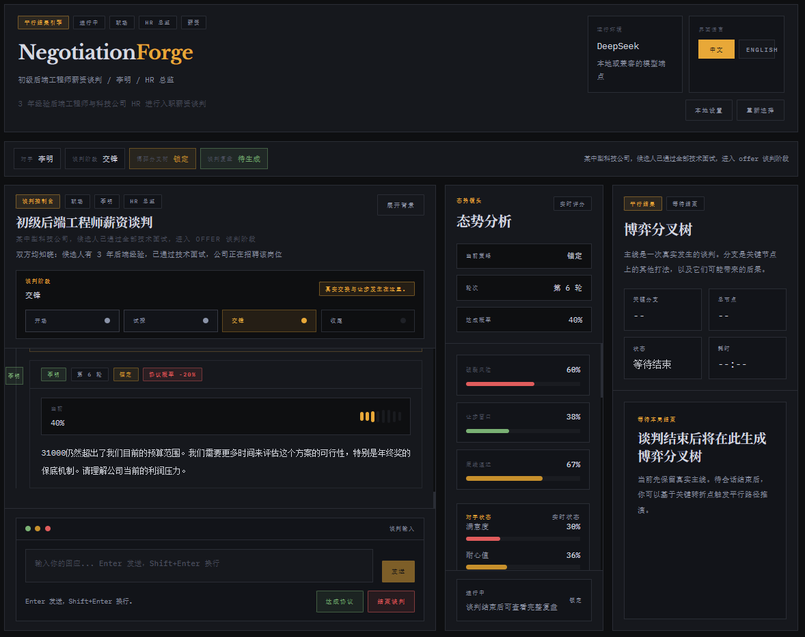
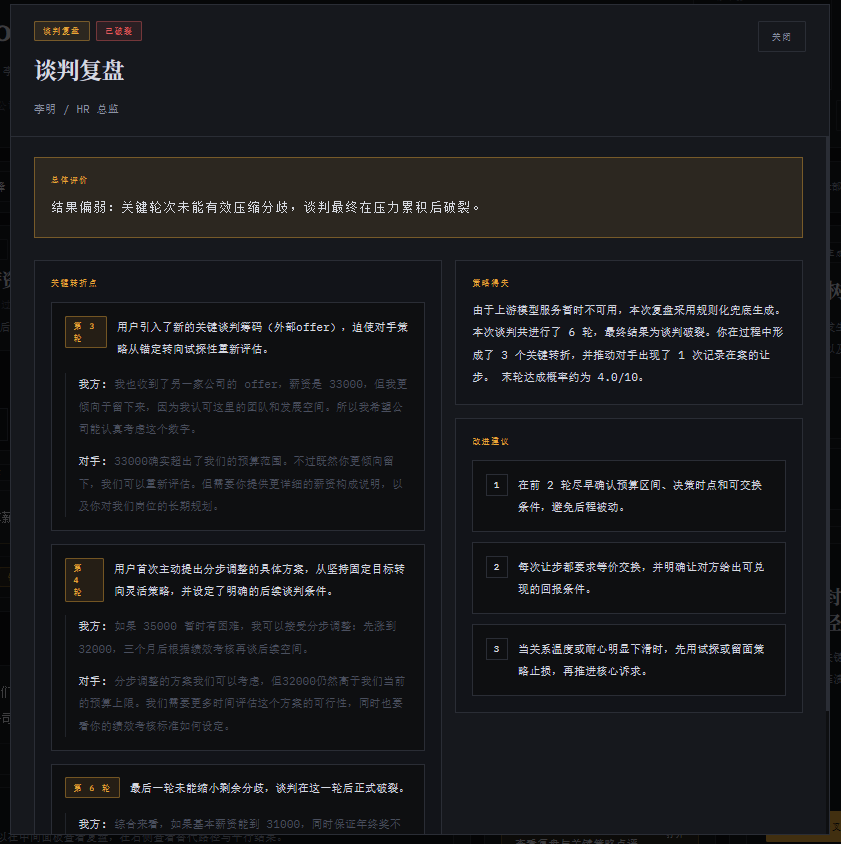
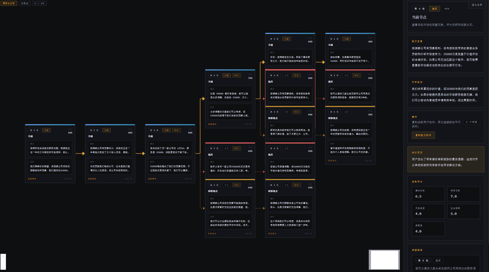
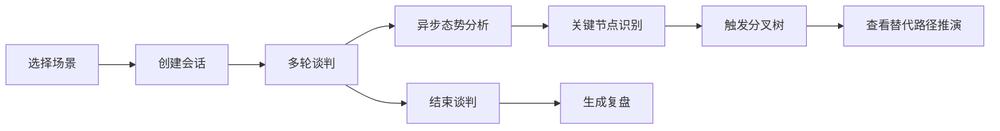

<p align="center">
  
</p>

<h1 align="center">NegotiationForge</h1>

<p align="center">
  🤝 对抗式谈判模拟、态势分析、复盘总结与博弈分叉树推演引擎
</p>

<p align="center">
  
  
  
  
  
  
</p>

<p align="center">
  <a href="./README.md">中文文档</a> |
  <a href="./README-EN.md">English</a> |
  <a href="./docs/QUICKSTART.md">快速开始</a> |
  <a href="./docs/CONFIGURATION.md">配置说明</a> |
  <a href="./docs/ARCHITECTURE.md">架构说明</a>
</p>

<p align="center">
  
</p>

## ✨ 项目简介

NegotiationForge 是一个面向谈判训练、策略实验与决策推演的 AI 系统。

你可以选择一个谈判场景，与具备目标、底线、情绪、耐心和策略切换能力的 AI 对手展开多轮交涉；在对局过程中，系统会持续生成态势评分与关键节点识别；在对局结束后，还可以进一步生成复盘总结，并在关键节点上构建替代路径，形成完整的博弈分叉树。

它不是一个普通聊天 Demo，而是一个更接近“谈判工作台”的实验项目，适合用于：

- 🎯 谈判训练与话术演练
- 🧠 AI Agent 行为设计实验
- 🔍 决策路径复盘与反事实分析
- 🧪 人机对抗式界面原型验证
- 📚 教学、研究与策略讨论

---

## 🖼️ 界面预览

<p align="center">
  
  <br />
  <sub>首页与场景面板：选择起始主线，查看对手画像与任务入口</sub>
</p>

<p align="center">
  
  <br />
  <sub>正式谈判工作台：聊天、态势分析与分叉树区域并列展示</sub>
</p>

<table>
  <tr>
    <td width="50%" align="center">
      
      <br />
      <sub>复盘界面：总结结果、关键节点与改进建议</sub>
    </td>
    <td width="50%" align="center">
      
      <br />
      <sub>分叉树界面：关键节点替代路径与后续推演</sub>
    </td>
  </tr>
</table>

---

## 🚀 核心能力

### 1. AI 谈判对手

- 不是单轮问答机器人，而是带有角色设定、目标、底线和状态的对手代理
- 会基于当前局势调整策略，例如施压、拖延、让步、坚持底线
- 会在多轮对话中累积耐心、满意度、关系温度等状态变量

### 2. 实时态势分析

- 每一轮对话结束后，后台异步生成本轮分析结果
- 输出维度包括：议价力、信息优势、关系温度、达成概率、满意度等
- 自动标记关键节点，供复盘与分叉树推演复用

### 3. 谈判复盘

- 对谈判结果进行结构化总结
- 输出关键转折点、有效动作、问题动作和下一次可改进方向
- 上游模型不可用时，后端还会启用规则化兜底复盘，避免前端直接报错

### 4. 博弈分叉树

- 在已识别的关键节点上生成替代用户策略
- 对每条替代策略继续进行 2 层推演
- 保留主线对话，并将分叉路径挂载到对应关键节点上

### 5. 本地优先开发体验

- 后端默认 SQLite，无需额外数据库即可运行
- 环境变量简单，适合本地验证与快速迭代
- 前后端职责清晰，便于继续扩展到更多场景或部署方式

---

## 🧱 技术栈

### 前端

- Next.js 15
- React 19
- TypeScript
- Tailwind CSS

### 后端

- FastAPI
- Pydantic
- SQLAlchemy Async
- SQLite

### 模型接入

- DeepSeek
- OpenAI Compatible API
- Gemini

---

## ⚡ 快速开始

### 1. 准备环境

确保本机已经安装：

- Python 3.11 或更高版本
- Node.js 20 或更高版本
- npm
- 至少一个可用的 LLM API Key

推荐优先使用 `DeepSeek`，因为当前仓库默认示例就是围绕它配置的。

### 2. 克隆仓库

```bash
git clone https://github.com/Powfu-zwx/NegotiationForge.git
cd NegotiationForge
```

### 3. 启动后端

```bash
cd backend
python -m venv .venv
```

Windows:

```powershell
.venv\Scripts\activate
```

macOS / Linux:

```bash
source .venv/bin/activate
```

安装依赖并准备环境变量：

```bash
pip install -r requirements.txt
cp .env.example .env
```

启动 API：

```bash
uvicorn app.main:app --reload
```

默认后端地址：

```text
http://localhost:8000
```

### 4. 启动前端

```bash
cd frontend
npm install
cp .env.local.example .env.local
npm run dev
```

默认前端地址：

```text
http://localhost:3000
```

### 5. 首次体验流程

1. 打开前端页面并选择一个谈判场景
2. 创建 session，进入正式谈判界面
3. 与 AI 对手进行多轮交互
4. 谈判结束后查看分析与复盘
5. 手动触发分叉树生成并查看关键节点替代路径

更详细的逐步指南见：[docs/QUICKSTART.md](./docs/QUICKSTART.md)

---

## ⚙️ 配置说明

### 后端环境变量

| 变量名 | 说明 | 默认值 |
| --- | --- | --- |
| `APP_ENV` | 运行环境标识 | `development` |
| `APP_HOST` | API 监听地址 | `0.0.0.0` |
| `APP_PORT` | API 监听端口 | `8000` |
| `DEBUG` | 是否开启调试 | `true` |
| `ALLOWED_ORIGINS` | 允许跨域来源 | `http://localhost:3000` |
| `LLM_PROVIDER` | 当前使用的模型提供方 | `deepseek` |
| `DEEPSEEK_API_KEY` | DeepSeek Key | 空 |
| `DEEPSEEK_BASE_URL` | DeepSeek 地址 | `https://api.deepseek.com` |
| `DEEPSEEK_MODEL` | DeepSeek 模型名 | `deepseek-chat` |
| `OPENAI_API_KEY` | OpenAI Compatible Key | 空 |
| `OPENAI_BASE_URL` | OpenAI Compatible 地址 | `https://api.openai.com/v1` |
| `OPENAI_MODEL` | OpenAI Compatible 模型名 | `gpt-4o-mini` |
| `GEMINI_API_KEY` | Gemini Key | 空 |
| `GEMINI_BASE_URL` | Gemini 地址 | `https://generativelanguage.googleapis.com/v1beta` |
| `GEMINI_MODEL` | Gemini 模型名 | `gemini-2.0-flash` |
| `DATABASE_URL` | 数据库连接串 | `sqlite+aiosqlite:///./negotiationforge.db` |

### 前端环境变量

| 变量名 | 说明 | 默认值 |
| --- | --- | --- |
| `NEXT_PUBLIC_API_URL` | 前端请求的后端 API 根地址 | `http://localhost:8000/api/v1` |

### 典型配置组合

#### 使用 DeepSeek

```env
LLM_PROVIDER=deepseek
DEEPSEEK_API_KEY=your-key
DEEPSEEK_BASE_URL=https://api.deepseek.com
DEEPSEEK_MODEL=deepseek-chat
```

#### 使用 OpenAI Compatible

```env
LLM_PROVIDER=openai
OPENAI_API_KEY=your-key
OPENAI_BASE_URL=https://api.openai.com/v1
OPENAI_MODEL=gpt-4o-mini
```

#### 使用 Gemini

```env
LLM_PROVIDER=gemini
GEMINI_API_KEY=your-key
GEMINI_BASE_URL=https://generativelanguage.googleapis.com/v1beta
GEMINI_MODEL=gemini-2.0-flash
```

更详细的配置与切换方式见：[docs/CONFIGURATION.md](./docs/CONFIGURATION.md)

---

## 🔌 API 概览

当前主要接口位于 `/api/v1` 下：

| 方法 | 路径 | 说明 |
| --- | --- | --- |
| `GET` | `/scenarios` | 获取可选谈判场景 |
| `POST` | `/sessions` | 创建新的谈判会话 |
| `POST` | `/sessions/{session_id}/chat` | 发送一轮用户消息并获取对手回复 |
| `POST` | `/sessions/{session_id}/complete` | 手动结束谈判，会话状态可设为 `agreement` 或 `breakdown` |
| `GET` | `/sessions/{session_id}/analysis` | 获取当前会话的分析结果 |
| `POST` | `/sessions/{session_id}/summary` | 生成复盘报告 |
| `GET` | `/sessions/{session_id}/summary` | 获取已生成的复盘报告 |
| `POST` | `/sessions/{session_id}/fork-tree` | 触发分叉树后台生成 |
| `GET` | `/sessions/{session_id}/fork-tree` | 查询分叉树状态或完整树数据 |

后端启动后还可访问：

- Swagger UI：`http://localhost:8000/docs`
- ReDoc：`http://localhost:8000/redoc`

---

## 🧭 核心使用流程



---

## 🗂️ 仓库结构

```text
NegotiationForge/
|- backend/
|  |- app/
|  |  |- api/routes/       # FastAPI 路由
|  |  |- core/             # 全局配置
|  |  |- db/               # 数据库与会话
|  |  |- llm/              # 模型适配层
|  |  |- models/           # Pydantic / ORM 模型
|  |  `- services/         # 业务服务
|  |- scenarios/           # 谈判场景 JSON
|  |- requirements.txt
|  `- .env.example
|- frontend/
|  |- app/                 # Next.js App Router
|  |- components/          # UI 组件
|  |- lib/                 # API 请求封装
|  |- package.json
|  `- .env.local.example
|- docs/
|  |- images/
|  |- ARCHITECTURE.md
|  |- CONFIGURATION.md
|  `- QUICKSTART.md
|- .github/
|- LICENSE
|- README.md
`- README-EN.md
```

---

## 📚 文档索引

| 文档 | 中文 | English |
| --- | --- | --- |
| 仓库首页 | [README.md](./README.md) | [README-EN.md](./README-EN.md) |
| 快速开始 | [docs/QUICKSTART.md](./docs/QUICKSTART.md) | [docs/QUICKSTART-EN.md](./docs/QUICKSTART-EN.md) |
| 配置说明 | [docs/CONFIGURATION.md](./docs/CONFIGURATION.md) | [docs/CONFIGURATION-EN.md](./docs/CONFIGURATION-EN.md) |
| 架构说明 | [docs/ARCHITECTURE.md](./docs/ARCHITECTURE.md) | [docs/ARCHITECTURE-EN.md](./docs/ARCHITECTURE-EN.md) |
| 贡献指南 | [CONTRIBUTING.md](./CONTRIBUTING.md) | [CONTRIBUTING-EN.md](./CONTRIBUTING-EN.md) |

---

## 🛠️ 常见问题

### 1. 前端能打开，但后端连不上

优先检查：

- `backend/.env` 是否存在
- `NEXT_PUBLIC_API_URL` 是否指向正确的后端地址
- 后端是否真的运行在 `http://localhost:8000`

### 2. 复盘生成时报模型错误

当前项目已经对上游模型异常做了重试与兜底处理，但如果提供方网络不稳定，仍然建议：

- 更换更稳定的网络环境
- 检查 API Key 是否可用
- 确认模型名称与 Base URL 是否匹配

### 3. 分叉树没有立即出现

分叉树是后台异步生成的。前端会轮询状态，你也可以刷新后再次查看结果。

### 4. 我可以提前结束谈判吗

可以。前端正式谈判界面已经支持手动结束，会调用 `/sessions/{session_id}/complete`。

---

## 🤝 贡献与开源

欢迎提交 Issue 与 Pull Request。

- 中文贡献说明：[CONTRIBUTING.md](./CONTRIBUTING.md)
- English guide: [CONTRIBUTING-EN.md](./CONTRIBUTING-EN.md)
- 安全策略：[SECURITY.md](./SECURITY.md)
- 社区行为准则：[CODE_OF_CONDUCT.md](./CODE_OF_CONDUCT.md)

---

## ⚠️ 免责声明

本项目主要用于研究、学习、教学演示、交互实验与谈判训练。

请不要将本项目的输出直接作为法律、劳动、投资、医疗或商业高风险决策的唯一依据。LLM 输出可能存在事实错误、偏差或不稳定行为，使用者需要自行判断与复核。

---

## 📄 License

本项目采用 [MIT License](./LICENSE) 开源。
