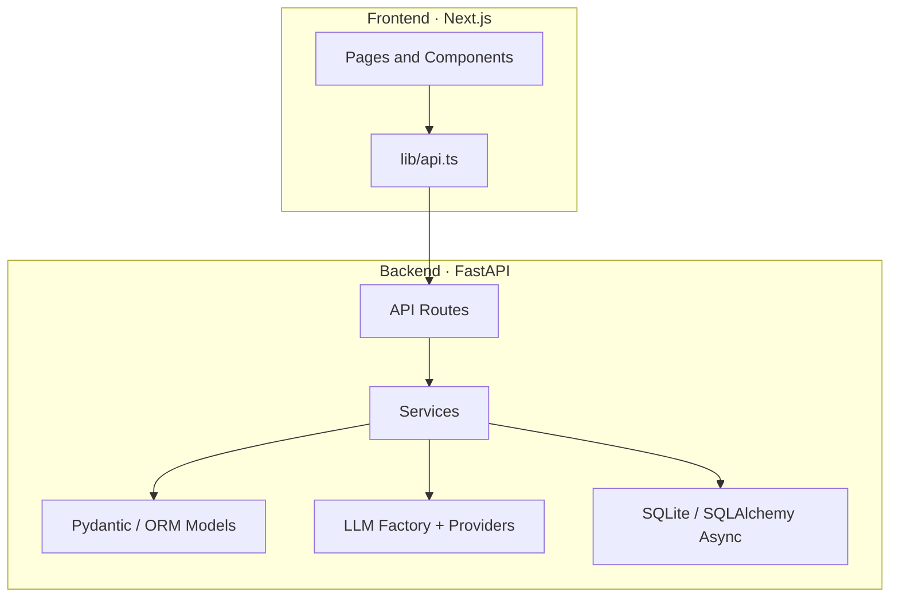
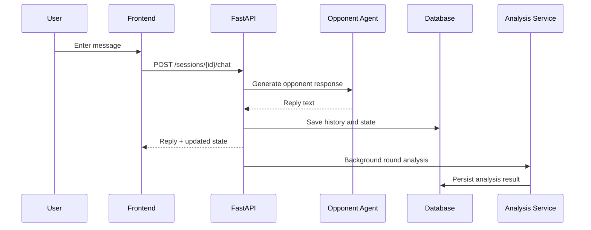
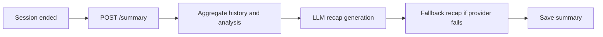

# Architecture

> Structural overview, data flow, and extension points for NegotiationForge

## 1. Design Goals

NegotiationForge is not just a chat demo. The architecture is designed to support a reusable negotiation workbench with analysis, recap, and counterfactual simulation layered on top of a live dialogue loop.

The current design focuses on:

- multi-round AI negotiation with persistent internal state
- asynchronous tactical analysis per round
- structured recap after the session ends
- fork-tree simulation from previously marked critical turns
- switching model providers without rewriting business logic

---

## 2. High-Level Structure



---

## 3. Frontend Layout

The frontend lives in `frontend/` and uses the Next.js App Router.

### Key directories

```text
frontend/
|- app/
|  |- layout.tsx
|  `- page.tsx
|- components/
|  |- Chat.tsx
|  |- AnalysisPanel.tsx
|  |- SummaryModal.tsx
|  |- ForkTree.tsx
|  `- ForkTreePanel.tsx
`- lib/
   `- api.ts
```

### Component responsibilities

- `page.tsx`
  - top-level page container
  - manages session status and workspace layout
- `Chat.tsx`
  - live negotiation interface
  - sending messages, rendering history, manual completion, compact scenario briefing
- `AnalysisPanel.tsx`
  - visualizes stored per-round analysis
- `SummaryModal.tsx`
  - renders the recap report
- `ForkTreePanel.tsx`
  - manages trigger, polling, and status of fork-tree generation
- `ForkTree.tsx`
  - recursively renders fork-tree nodes

---

## 4. Backend Layout

The backend lives in `backend/app/`.

### Key directories

```text
backend/app/
|- api/routes/
|- core/
|- db/
|- llm/
|- models/
`- services/
```

### Module responsibilities

#### `api/routes/`

- `negotiation.py`
  - scenario listing
  - session creation
  - live chat
  - manual negotiation completion
  - analysis retrieval
  - recap generation and retrieval
- `fork_tree.py`
  - trigger asynchronous fork-tree generation
  - read fork-tree status or full tree

#### `core/`

- `config.py`
  - loads application settings from environment variables

#### `db/`

- `database.py`
  - SQLAlchemy Async engine and sessions
  - database initialization
  - backwards-compatible migration logic for new `sessions` columns

#### `llm/`

- `base.py`
  - abstract provider interface, exception types, retry logic
- `factory.py`
  - chooses the active provider based on configuration
- `providers/`
  - DeepSeek / OpenAI-compatible / Gemini adapters

#### `models/`

- `session.py`
  - session state, history, analysis result models, recap content
- `fork_tree.py`
  - recursive fork-tree models
- `scenario.py`
  - scenario models

#### `services/`

- `session_manager.py`
  - session persistence and fork-tree state storage
- `opponent_agent.py`
  - generates opponent turns
- `analysis_agent.py`
  - performs tactical analysis for a round
- `analysis_service.py`
  - orchestrates analysis storage, recap generation, fallback recap
- `fork_generator.py`
  - generates alternative strategies for critical turns
- `deduction_engine.py`
  - simulates a two-layer continuation for a branch
- `tree_builder.py`
  - assembles the full tree from mainline + branches
- `prompt_builder.py`
  - shared prompt construction helpers

---

## 5. Key Data Flows

### 5.1 Live negotiation flow



### 5.2 Recap flow



### 5.3 Fork-tree flow

```mermaid
flowchart LR
    A["Session ended"] --> B["POST /fork-tree"]
    B --> C["Mark status as generating"]
    C --> D["Start background task"]
    D --> E["Load history and analysis"]
    E --> F["Locate critical turns"]
    F --> G["Generate alternative strategies"]
    G --> H["Simulate 2-layer branch continuations"]
    H --> I["Assemble full ForkTree"]
    I --> J["Persist into sessions.fork_tree_data"]
```



---

## 6. State Model

### Session states

Core session states are:

- `active`
- `agreement`
- `breakdown`

Anything other than `active` is treated by the frontend as a finished negotiation.

### Fork-tree states

Fork-tree generation uses:

- `pending`
- `generating`
- `done`
- `error`

The polling UI consumes this state directly.

---

## 7. Persistence Strategy

SQLite is the default persistence layer for local development.

### Role of the `sessions` table

It carries more than basic session metadata:

- conversation history
- opponent state snapshots
- recap content
- fork-tree status and serialized tree data

### Why fork trees are stored as JSON

The current project stores the tree as a serialized JSON blob in `fork_tree_data` instead of normalizing it into separate node and edge tables.

Advantages:

- simpler implementation
- fast iteration on the structure
- sufficient for the current product phase

Tradeoffs:

- poor queryability
- not ideal for analytics-heavy production use

If the project grows into deeper analysis or multi-user collaboration, a normalized graph-friendly storage model would be a better fit.

---

## 8. Why the LLM Layer Is Abstracted

The `backend/app/llm/` layer exists so business services do not care about vendor-specific SDK details.

Service code should focus on:

- what prompt to send
- what structured output is expected
- how to recover from failures

The provider selection itself is delegated to `factory.py` plus provider adapters. This makes it much easier to:

- switch providers without rewriting higher-level logic
- tune provider-specific timeout and retry behavior
- later mix stronger models and cheaper models in different parts of the pipeline

---

## 9. Why Background Work Matters

Three operations are clearly better as asynchronous work:

- round-by-round tactical analysis
- recap generation after session completion
- fork-tree generation

Putting all of them directly on the request path would make the UI feel sluggish. The current approach is:

- per-round analysis runs in the background
- fork-tree generation runs via `asyncio.create_task()`
- the frontend polls for progress

That keeps the implementation simple while still preserving acceptable UX.

---

## 10. Main Extension Points

The most natural next steps are:

### Scenario system

- more scenario JSON files
- a visual scenario editor
- multi-party negotiation support

### Analysis system

- more scoring dimensions
- richer explanations
- trend views across rounds

### Fork-tree engine

- deeper branch depth
- interactive branch continuation
- token budget and cache controls

### Persistence and deployment

- move from SQLite to PostgreSQL
- user accounts and isolation
- shared sessions and collaboration

---

## 11. Current Limitations

- limited scenario library
- fork-tree depth is fixed at 2
- recap and analysis quality depend on provider output quality
- SQLite is optimized for local work, not for heavy concurrency
- multi-user auth and permission systems are not implemented yet

---

## 12. Related Docs

- [Quick Start](./QUICKSTART-EN.md)
- [Configuration](./CONFIGURATION-EN.md)
- [中文架构说明](./ARCHITECTURE.md)
