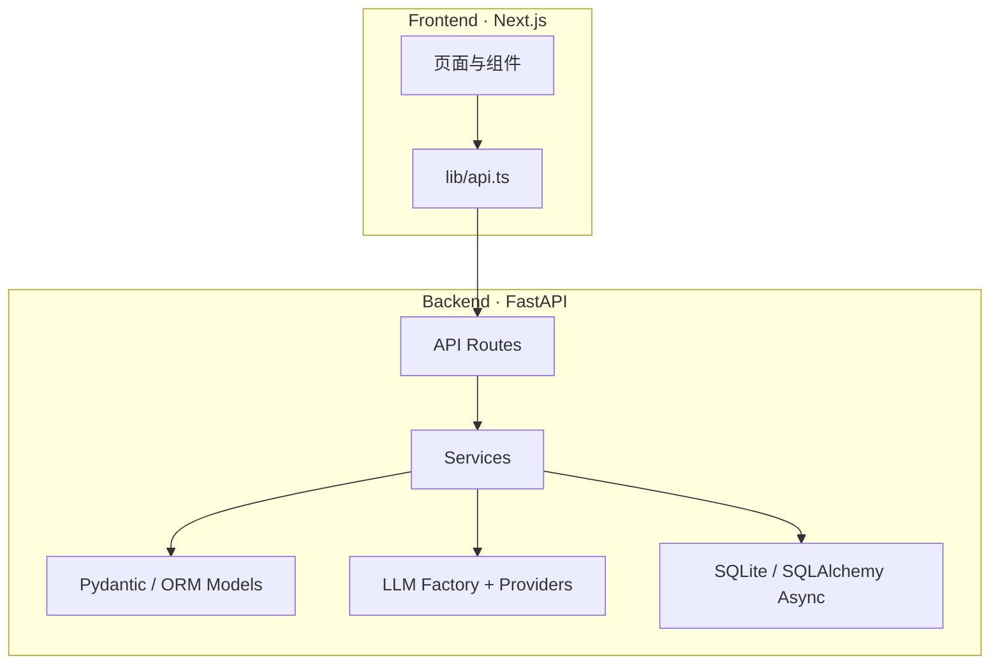
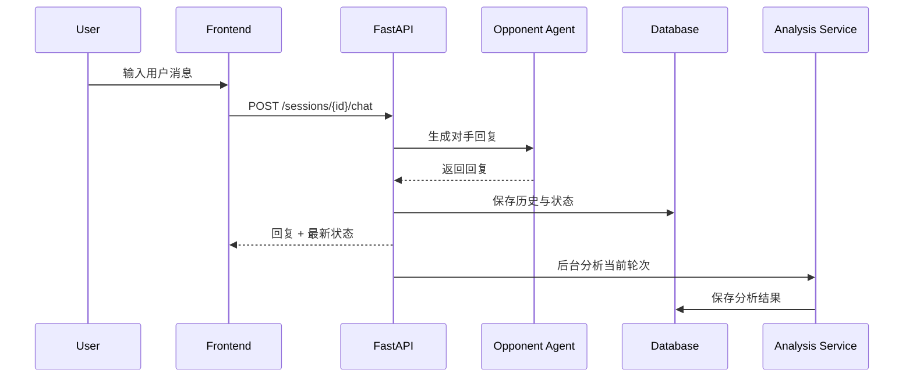
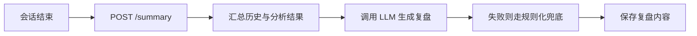
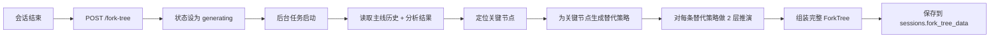

# 架构说明

> NegotiationForge 的整体结构、核心数据流与可扩展点说明

## 1. 设计目标

NegotiationForge 的后端与前端拆分比较明确，目标不是只做一个对话演示，而是搭建一个可以持续扩展的“谈判工作台”。

当前架构重点解决以下问题：

- 如何让 AI 对手具备持续多轮的状态与策略变化
- 如何在对话过程中异步分析每一轮谈判态势
- 如何在谈判结束后继续做复盘与关键节点分叉推演
- 如何在不绑定单一模型厂商的前提下切换 LLM 提供方

---

## 2. 总体结构



---

## 3. 前端结构

前端位于 `frontend/`，使用 Next.js App Router。

### 主要目录

```text
frontend/
|- app/
|  |- layout.tsx
|  `- page.tsx
|- components/
|  |- Chat.tsx
|  |- AnalysisPanel.tsx
|  |- SummaryModal.tsx
|  |- ForkTree.tsx
|  `- ForkTreePanel.tsx
`- lib/
   `- api.ts
```

### 组件职责

- `page.tsx`
  - 页面级容器
  - 管理当前 session、谈判完成态、右侧面板显示逻辑
- `Chat.tsx`
  - 正式谈判主界面
  - 负责消息发送、对话展示、结束谈判、顶部紧凑场景摘要
- `AnalysisPanel.tsx`
  - 展示每轮态势分析结果
- `SummaryModal.tsx`
  - 展示复盘报告
- `ForkTreePanel.tsx`
  - 管理分叉树触发、轮询与状态展示
- `ForkTree.tsx`
  - 递归渲染分叉树节点

---

## 4. 后端结构

后端位于 `backend/app/`。

### 主要目录

```text
backend/app/
|- api/routes/
|- core/
|- db/
|- llm/
|- models/
`- services/
```

### 模块职责

#### `api/routes/`

- `negotiation.py`
  - 场景列表
  - 会话创建
  - 发送消息
  - 手动结束谈判
  - 查询分析
  - 生成/读取复盘
- `fork_tree.py`
  - 触发分叉树异步生成
  - 查询分叉树状态或完整结果

#### `core/`

- `config.py`
  - 从环境变量加载配置

#### `db/`

- `database.py`
  - SQLAlchemy Async 引擎与 Session
  - 初始化数据库
  - 向后兼容地补齐 `sessions` 表新增列

#### `llm/`

- `base.py`
  - LLM 抽象接口、错误类型、基础重试逻辑
- `factory.py`
  - 按环境变量返回具体 provider
- `providers/`
  - DeepSeek / OpenAI Compatible / Gemini 适配器

#### `models/`

- `session.py`
  - 会话、对话历史、分析结果、复盘内容
- `fork_tree.py`
  - 分叉树与分叉节点递归模型
- `scenario.py`
  - 场景模型

#### `services/`

- `session_manager.py`
  - 会话读写、状态持久化、分叉树状态保存
- `opponent_agent.py`
  - 生成对手回复
- `analysis_agent.py`
  - 单轮态势分析
- `analysis_service.py`
  - 分析结果落库、复盘生成、兜底复盘
- `fork_generator.py`
  - 生成关键节点的替代策略
- `deduction_engine.py`
  - 对替代策略做 2 层推演
- `tree_builder.py`
  - 组装主线 + 分叉得到完整树
- `prompt_builder.py`
  - 构造核心 Prompt

---

## 5. 关键数据流

### 5.1 正式谈判流程



### 5.2 复盘流程



### 5.3 分叉树流程



---

## 6. 状态模型

### 会话状态

当前会话核心状态分为：

- `active`
- `agreement`
- `breakdown`

只要状态不是 `active`，前端就会把谈判视为“已结束”，从而允许复盘和分叉树生成。

### 分叉树状态

分叉树状态分为：

- `pending`
- `generating`
- `done`
- `error`

这套状态被前端轮询面板直接消费。

---

## 7. 持久化设计

项目当前默认使用 SQLite，本地开发体验优先。

### `sessions` 表的职责

它不仅记录会话基础信息，还承载：

- 对话历史
- 对手状态快照
- 分析结果关联
- 复盘内容
- 分叉树状态与序列化树数据

### 分叉树持久化方式

分叉树不是拆表存储，而是直接序列化为 JSON 字符串写入 `fork_tree_data`。

这样做的优点：

- 实现简单
- 对目前的数据结构足够实用
- 便于快速迭代结构

缺点也很明显：

- 不适合复杂查询
- 不适合大规模分析统计

如果将来进入更重的数据分析阶段，可以再拆成节点表与边表。

---

## 8. LLM 抽象层设计

`backend/app/llm/` 的设计原则是：业务服务不直接依赖具体厂商 SDK。

也就是说，业务层只关心：

- 发送什么 prompt
- 希望拿到什么结构化输出
- 如何处理异常和 fallback

至于底层到底接的是 DeepSeek、OpenAI Compatible 还是 Gemini，由 `factory.py` 和 provider 适配器负责。

这让我们可以：

- 用同一套业务逻辑切换模型来源
- 为不同 provider 加不同的超时和重试策略
- 在未来引入更复杂的“主模型 + 轻量模型”混合方案

---

## 9. 为什么采用异步任务

项目当前有三个明显适合异步化的动作：

- 单轮对话后的态势分析
- 谈判结束后的复盘生成
- 分叉树后台构建

如果把这些任务全部放到用户同步请求里，会让前端等待时间明显变差。

因此当前实现里：

- 每轮分析由后台任务触发
- 分叉树通过 `asyncio.create_task()` 在后台生成
- 前端通过轮询获取状态

这是一种实现成本低、当前实现里也足够可控的方案。

---

## 10. 主要扩展点

如果你要继续往后做，这几个位置最值得扩展：

### 场景系统

- 支持更多 JSON 场景
- 提供可视化场景编辑器
- 增加多角色协商场景

### 分析体系

- 增加更多评分维度
- 引入解释性更强的标签
- 为每轮分析提供趋势图

### 分叉树引擎

- 增加更深层级
- 支持用户选择分叉继续展开
- 引入成本控制策略和缓存

### 持久化与部署

- 从 SQLite 迁移到 PostgreSQL
- 增加用户体系
- 支持多人协作与共享会话

---

## 11. 当前限制

当前项目仍然有一些明确限制：

- 场景数量有限
- 分叉树深度固定为 2 层
- 分析与复盘质量依赖模型质量
- SQLite 更适合本地开发而非高并发生产
- 暂未提供完善的权限系统与多用户隔离

---

## 12. 相关阅读

- [快速开始](./QUICKSTART.md)
- [配置说明](./CONFIGURATION.md)
- [English Architecture](./ARCHITECTURE-EN.md)
